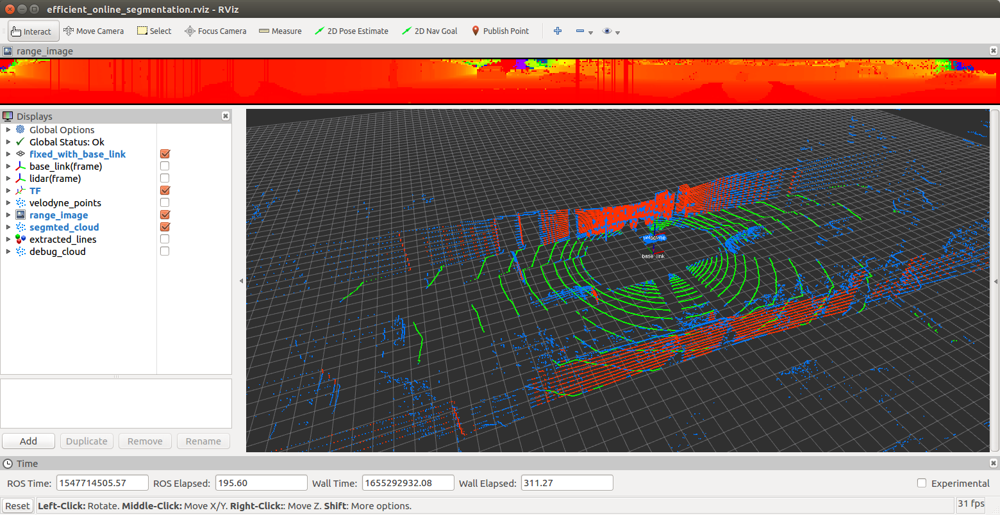

# Efficient Online Segmentation of Ground&Wall Points

## Update 20220619
1. 所有参数已支持通过yaml文件配置！Now you can configure all the parameters through a *segmentation_params.yaml* file!
2. 支持任意线数的旋转式机械激光雷达，已测试16线和32线（用的[UrbanLoco](https://github.com/weisongwen/UrbanLoco)开源数据集），只需通过yaml文件配置相应相应参数即可。 Support all multi-line spinning LiDARs! 16-line and 32-line have been fully tested with self-made dataset and [UrbanLoco dataset](https://github.com/weisongwen/UrbanLoco)(I used HK-Data20190117).
3. 支持激光雷达以任意姿态安装，而不仅仅是水平姿态，只需要在yaml文件中设置好roll/pitch/height即可。Support arbitrary orientation that the LiDAR is mounted. However you mount your LiDAR, this algorithm works!
4. 新版的测试视频已放到了知乎文章中，点[这里](https://zhuanlan.zhihu.com/p/508961457)。Click [here](https://zhuanlan.zhihu.com/p/508961457) to see a new vedio about the algorithm test on UrbanLoco dataset.  

**UrbanLoco测试截图(Here is a screenshot of test on UrbanLoco dataset):**

## 1. Introduction 
This is a **light-weight & efficient** online segmentation algorithm for segmenting **ground points and wall points** out of an arbitrary LiDAR point cloud. 

This algorithm is inspired by *"M. Himmelsbach, F. v. Hundelshausen and H. -. Wuensche, **Fast segmentation of 3D point clouds for ground vehicles**, 2010 IEEE Intelligent Vehicles Symposium, 2010"*, an original implementation can be accessed here [linefit_ground_segmentation](https://github.com/lorenwel/linefit_ground_segmentation).

See the picture below for a first look, where yellow lines(also magenta points) indicate ground points, and green lines(also green points) indicate wall points.

## 2. Results & Videos 
`coming soon ...`  
A test video can be seen on my personal Zhihu homepage, click [here](https://zhuanlan.zhihu.com/p/508961457).

## 3. Algorithm Detail & Implementation
`coming soon ...`  
A chinese version can be seen on my personal Zhihu homepage, click [here](https://zhuanlan.zhihu.com/p/508961457).

## 4. Dependencies 
This project is also light-weight in dependencies, only **PCL & OpenCV** are required, you can easily install these two by `apt-get install`. Note that PCL is essential while OpenCV is only for visualization of range image. A developer should take no trouble to remove OpenCV dependency with just a little bit modification on original codes.

## 5. Compile & Run
Once you have solved the dependencies problem, just execute `catkin_make` and `roslaunch efficient_online_segmentation efficient_online_segmentation.launch`. See the *.launch* file for detail.

By default, **VLP-16 LiDAR scanner** or any other 16-rings LiDAR are supported. If you want to see how **32/64/128 LiDAR scanners** work, just modify LiDAR related parameters in `sgmtt_utility.h/SegmentationParams`.

## 6. Future TODOs  
1. Extract wall points with the aid of normal information, that means we should take neighbor lines into consideration.  
...
